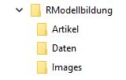
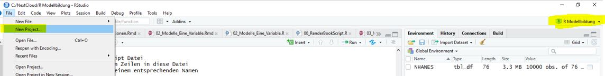

# {-}

<center>

{ width=100% }

</center>

# Vorbemerkung {-}

Dieses Skriptum wurde mit dem Paket *bookdown* erstellt. Der verwendete R-Code wird als Teil des Skriptums angeführt und kann auch direkt von diesem Dokument in ein R-Skript übernommen und ausgeführt werden. Erläuterungen zum Code beschränken sich zum Teil auf wesentliche Code-Fragmente. Für detaillierte Angaben zu diversen Funktionen ist die R-Hilfe zu verwenden.

Der nachfolgende Code ist spezifisch für die Erstellung dieses Dokumentes, sowie der Bearbeitung der Beispiele im Kurs von Bedeutung. Es wird in diesem Code-Teil sichergestellt, dass die verwendeten Pakte vorhanden und geladen sind. Daher sollte dieser Code am Anfang jeder neuen R-Datei übernommen werden. Die Vorgehensweise ist:

1. Starten von R-Studio
2. Öffnen einer neuen R-Script-Datei
3. Kopiere die nachfolgenden Zeilen in diese Datei
4. Speichere die Datei mit einem entsprechenden Namen
5. Führe diesen Code aus
6. Füge deinen Code nach diesen Zeilen ein


```r
# Initialisierung
rm(list = ls())
if (!require("pacman")) install.packages("pacman")
pacman::p_load(corrplot, DAAG, dataMaid, devtools, doBy, DT, 
               ggformula, ggplot2, gridExtra, htmlwidgets, 
               imager, knitr, labelled, leaps, magick, MASS, 
               NHANES, mosaic, mosaicCore, mosaicData, pander,
               pastecs, ppcor, reshape2, 
               rockchalk, rpart, rpart.plot)
```

Des Weiteren ist es von Vorteil, zu Beginn einer Auswertung/Datenanalyse mit R eine entsprechende Verzeichnisstruktur im Windows-Dateimanager festzulegen und für diese Struktur ein R-Projektfile anzulegen. Die Verzeichnisstruktur richtet sich im Allgemeinen nach der jeweiligen Analyse, folgende Vorgaben haben sich aber bewährt:

<center>

{ width=20% }

</center>

Die Root kann dabei entweder auf der lokalen Festplatte (C:/..) oder einem Server, bzw. Cloud (../NextCloud/R Modellbildung/Images) liegen.

Das Anlegen eines R-Projektes wird im RStudio durchgeführt.

<center>

{ width=100% }

</center>

Nachdem bereits eine Verzeichnisstruktur definiert wurde, kann man das Projekt in das bereits definierte Verzeichnis legen (folge den Schritten die von RStudio vorgegeben werden). Den Vorteil des projektbasierten Arbeitens werden wir im Verlauf des Kurses noch näher kennen lernen.

Inhalte, Beispiele und Daten stammen teilweise aus dem Internet, u.a. [@Coursera.2018], [@DataCamp.2018] und den Büchern [@Field.2017], [@Buhner.2009] und [@Buhner.2017].

# Motivation {-}

Modelle werden meist dazu verwendet, um komplexe Sachverhalte zu beschreiben und Erklärungen für deren Wirkungsweise, Ursachen und Zusammenhänge zu finden. In diesem Seminar wollen wir uns mit der einfachen statistischen Modellbildung beschäftigen. 

Das Wesentliche und gleichzeitig auch das Schwierigste bei der Modellbildung ist die Identifizierung und Zuordnung der einzelnen Bausteine und nicht - wie oft angenommen - die einem statistischen Modell zugrundeliegende Mathematik. Obwohl die mathematischen Grundlagen für die Anwendung bestimmter Modellvorstellungen enorm wichtig und Kenntnisse darüber auch für die Abschätzung der Güte und Gültigkeit eines Modells erforderlich sind, spielen formale und mathematische Details in der Anwendung sehr oft nur eine nebensächliche Rolle.

In diesem Seminar sollten die Ziele, Einschränkungen, Vor- und Nachteile statistischer Modelle anhand von theoretischen, aber auch praktischen Überlegungen näher gebracht werden. Die Klärung der zentralen Fragen jeder Art von Modellbildung stehen dabei im Vordergrund, d.h.:

* wie kann ich mit *möglichst einfachen Mitteln* die "Wirklichkeit" möglichst gut zu beschreiben?
* wie kann ich beurteilen, ob mein Modell *gut* ist (zumindest im Vergleich mit anderen Modellen)?
* wie kann ich die Wichtigkeit einzelner Modellbausteine beurteilen?
* welche Erkenntnisse darf ich aus meinem Modell auf die Wirklichkeit übertragen?

